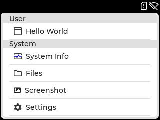
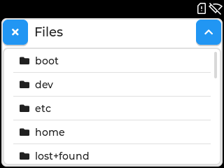
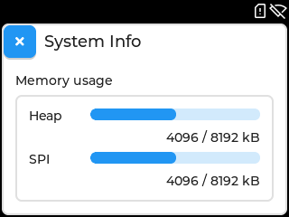
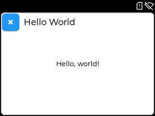
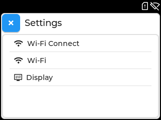
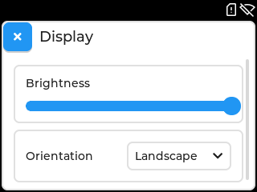
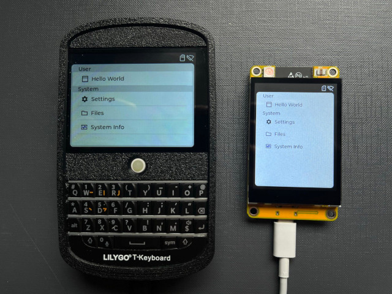

## Overview

Tactility is a front-end application platform for ESP32. It is mainly intended for touchscreen devices.
It provides an application framework that is based on code from the [Flipper Zero](https://github.com/flipperdevices/flipperzero-firmware/) project.

**Status: Alpha**

Tactility features a desktop that can launch apps:

 

 

Through the Settings app you can connect to Wi-Fi or change the display settings:

  

Play with the built-in apps or build your own! Use one of the supported devices or set up the drivers for your own hardware platform.



Noteworthy features:
- Touch UI capabilities (via LVGL) with support for input devices such as on-device trackball or keyboard.
- An application platform that can run apps and services.
- Basic applications to boost productivity, such as a Wi-Fi connectivity app.
- Run Tactility apps on PC to speed up development.

Requirements:
- ESP32 (any?) with a touchscreen
- [esp-idf 5.2](https://docs.espressif.com/projects/esp-idf/en/v5.2/esp32/get-started/index.html) or a newer v5.2.x

## Making apps is easy!

The app manifest provides basic information like the application name.
It also describes the [app lifecycle](docs/app-lifecycle.md):
It tells Tactility which functions need to be called when the app is started/shown/etc.

UI is created with [lvgl](https://github.com/lvgl/lvgl) which has lots of [widgets](https://docs.lvgl.io/8.3/widgets/index.html)!
Creating a touch-capable UI is [easy](https://docs.lvgl.io/8.3/get-started/quick-overview.html) and doesn't require your own render loop!

```c
static void app_show(App app, lv_obj_t* parent) {
    // Default toolbar with app name and close button
    lv_obj_t* toolbar = tt_toolbar_create_for_app(parent, app);
    lv_obj_align(toolbar, LV_ALIGN_TOP_MID, 0, 0);
    
    // Label widget
    lv_obj_t* label = lv_label_create(parent);
    lv_label_set_text(label, "Hello, world!");
    lv_obj_align(label, LV_ALIGN_CENTER, 0, 0);
    // Widgets are auto-removed from the parent when the app is closed
}

const AppManifest hello_world_app = {
    .id = "helloworld",    // Used to identify and start an app
    .name = "Hello World", // Shown on the desktop and app's toolbar
    .icon = NULL,
    .type = AppTypeUser,
    .on_start = NULL,
    .on_stop = NULL,
    .on_show = &app_show,  // A minimal setup sets the on_show() function
    .on_hide = NULL
};
```


## Supported Hardware

Any ESP32 device with a touchscreen should be able to run Tactility,
because LVGL is set up in a platform-agnostic manner.
Implementing drivers can take some effort, so Tactility provides support for several devices.

Predefined configurations are available for:

| Device                                   | Screen&Touch | SD card | Power | Other    |
|------------------------------------------|--------------|---------|-------|----------|
| [M5Stack Core2][m5stack]                 | ✅            | ✅       | ✅ |          |
| [M5Stack CoreS3][m5stack]                | ✅            | ✅       | ✅ |          |
| [LilyGo T-Deck][tdeck]                   | ✅            | ✅       |   | Keyboard | 
| [Waveshare S3 Touch][waveshare_s3_touch] | ✅            | ⏳       |   |          |
| Yellow Board 2432S024C (\*)              | ✅            | ✅       |   |          |

- ✅: Capable and implemented
- ⏳: Capable but not yet implemented
- ❌: Not capable

(*) Note: Only the capacitive version is supported. See AliExpress [here][2432s024c_1] and [here][2432s024c_2].

[tdeck]: https://www.lilygo.cc/products/t-deck
[waveshare_s3_touch]: https://www.waveshare.com/wiki/ESP32-S3-Touch-LCD-4.3
[2432s024c_1]: https://www.aliexpress.com/item/1005005902429049.html
[2432s024c_2]: https://www.aliexpress.com/item/1005005865107357.html
[m5stack]: https://m5stack.com/

## Guide

### Cloning from git

Ensure you clone the repository including the submodules! For example:

```bash
git clone --recurse-submodules -j8 https://github.com/ByteWelder/Tactility.git
```

### Build environment setup

Ensure you have [esp-idf 5.2](https://docs.espressif.com/projects/esp-idf/en/v5.2/esp32/get-started/index.html) installed, then select the correct device:

Copy the `sdkconfig.board.YOUR_BOARD` into `sdkconfig`. Use `sdkconfig.defaults` if you are setting up a custom board.

### Building firmware

You can run `idf.py flash monitor`, but there are some helpers available too:

`./build.sh` - build the ESP-IDF or the PC version of Tactility (*)
`./build.sh -p /dev/ttyACM0` - optional: you can pass on extra parameters for esp-idf builds
`./run.sh` - Does `flash` and `monitor` for ESP-IDF and simply builds and starts it for PC

The build scripts will detect if ESP-IDF is available. They will adapter if you ran `${IDF_PATH}/export.sh`.

### Development

Take a look at the [App Lifecycle](docs/app-lifecycle.md) or the [dependency diagram](docs/project-structure.puml) (this uses [PlantUML](https://plantuml.com)).

Directories explained:

- `app-esp`: The ESP32 application example
- `app-sim`: The PC/simulator application example
- `boards`: Contains ESP modules with drivers
- `tactility`: The main application platform code ([src/](./tactility/src))
- `tactility-headless`: Service framework and default services.
- `tactility-core`: Core functionality regarding threads, stdlib, etc. ([src/](./tactility-core/src))
- `libs`: Contains a mix of regular libraries and ESP modules

Until there is proper documentation, here are some pointers:

## License

[GNU General Public License Version 3](LICENSE.md)

