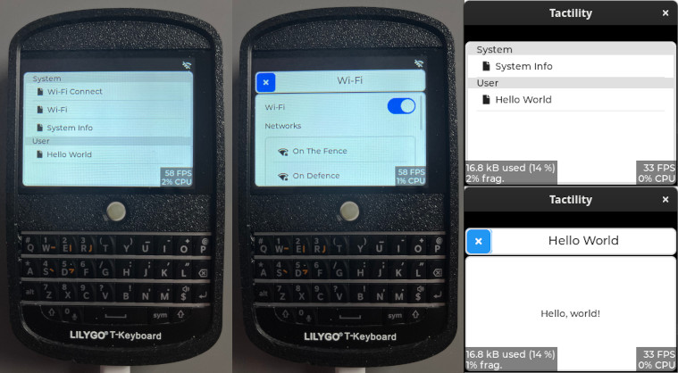

## Overview

Tactility is a front-end application platform for ESP32. It is mainly intended for touchscreen devices.
It provides an application framework that is based on code from the [Flipper Zero](https://github.com/flipperdevices/flipperzero-firmware/) project.

**Status: Alpha**

Tactility features:
- A hardware abstraction layer
- UI capabilities (via LVGL)
- An application platform that can run apps and services
- PC app support to speed up development for ESP32 apps

Requirements:
- ESP32 (any?) with a display (connected via SPI or I2C)
- [esp-idf 5.1.2](https://docs.espressif.com/projects/esp-idf/en/v5.1.2/esp32/get-started/index.html) or a newer v5.1.x

## Technologies

UI is created with [lvgl](https://github.com/lvgl/lvgl) via [esp_lvgl_port](https://github.com/espressif/esp-bsp/tree/master/components/esp_lvgl_port).

LCD and input drivers are based on [esp_lcd](https://docs.espressif.com/projects/esp-idf/en/latest/esp32/api-reference/peripherals/lcd.html)
and [esp_lcd_touch](https://components.espressif.com/components/espressif/esp_lcd_touch).

## Supported Hardware

### Devices

Predefined configurations are available for:
- Yellow Board: 2.4" with capacitive touch (2432S024C) (see AliExpress [1](https://www.aliexpress.com/item/1005005902429049.html), [2](https://www.aliexpress.com/item/1005005865107357.html))
- LilyGo T-Deck (see [lilygo.cc](https://www.lilygo.cc/products/t-deck), [AliExpress](https://www.aliexpress.com/item/1005005692235592.html))
- (more will follow)

Other configurations can be supported, but they require you to set up the drivers yourself:

- Display drivers: [esp-bsp](https://github.com/espressif/esp-bsp/blob/master/LCD.md) and [Espressif Registry](https://components.espressif.com/components?q=esp_lcd).
- Touch drivers: [Espressif Registry](https://components.espressif.com/components?q=esp_lcd_touch).

## Guide

### Build environment setup

Ensure you have [esp-idf 5.1.2](https://docs.espressif.com/projects/esp-idf/en/v5.1.2/esp32/get-started/index.html) installed, then select the correct device:

Copy the `sdkconfig.board.YOUR_BOARD` into `sdkconfig`. Use `sdkconfig.defaults` if you are setting up a custom board.

### Building firmware

You can run `idf.py flash monitor`, but there are some helpers available too:

`./build.sh` - build the ESP-IDF or the PC version of Tactility (*)
`./build.sh -p /dev/ttyACM0` - optional: you can pass on extra parameters for esp-idf builds
`./run.sh` - Does `flash` and `monitor` for ESP-IDF and simply builds and starts it for PC

The build scripts will detect if ESP-IDF is available. They will adapter if you ran `${IDF_PATH}/export.sh`.

### Development

Directories explained:

- `app-esp`: The ESP32 application example
- `app-sim`: The PC/simulator application example
- `boards`: Contains ESP modules with drivers
- `tactility`: The main application platform code ([src/](./tactility/src))
- `tactility-esp`: ESP-specific application code (e.g. wifi app and service)
- `tactility-core`: Core functionality regarding threads, stdlib, etc. ([src/](./tactility-core/src))
- `libs`: Contains a mix of regular libraries and ESP modules

Until there is proper documentation, here are some pointers:

## License

[GNU General Public License Version 3](LICENSE.md)

