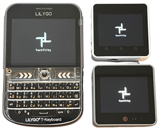
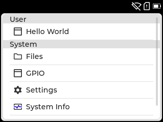
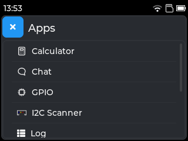
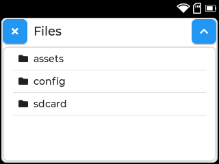
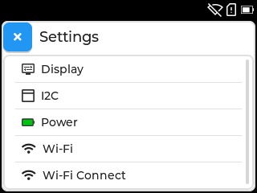
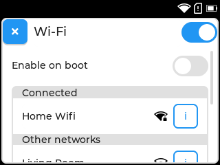

## Overview

Tactility is an operating system that focuses on the ESP32 microcontroller family.

See [https://tactility.bytewelder.com](https://tactility.bytewelder.com) for more information.

Status: pre-release

&nbsp;&nbsp;

You can run built-in apps or start them from an SD card:

&nbsp;&nbsp;

It's easy to manage system settings:

&nbsp;&nbsp;

## License

[GNU General Public License Version 3](LICENSE.md)
