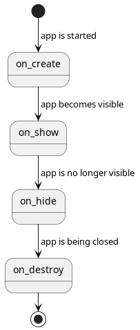

# Application Lifecycle

The app goes through these states:

Let's look at a scenario where an app launches another app:

1. `first` app starts: `first.on_create()` -> `first.on_show()`
2. `second` app starts: `first.on_hide()` -> `second.on_create()` -> `second.on_show()`
3. `second` app stops: `second.on_hide()` -> `second.on_destroy()` -> `first.on_show()`
4. `first` app stops: `first.on_hide()` -> `first.on_destroy()`
